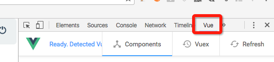

# VUE基础相关概念

Before start:

- 给编辑器添加vue文件高亮插件，atom中使用安装language-vue-component
- vue.js devtools，[下载地址](https://github.com/vuejs/vue-devtools),安装完成后,必须进入chrome扩展工具选项里,找到vue-devtools把下面的 允许访问文件网址勾选上。<br>
  <br>
  通过该工具则可观察vue组件内数据绑定事件等进行调试。

## VUE基础概念简介（V1.0 [官网](http://cn.vuejs.org/guide)）

- 数据绑定，`<span>Message: {{ msg }}</span>` 双括号内则与组件内声明的数据是同步的，在msg的值改变时DOM视图也会更新，不用再选择器再进行操作一次。
- 双向绑定，v-model进行双向数据绑定，以下在input内容变化时span标签内的数据同步改变。

  ```
  <span>Message is: {{ message }}</span>
  <input type="text" v-model="message"">
  ```

- 条件渲染，`<h1 v-if="ok">Yes</h1>`，`<h1 v-show="ok">Hello!</h1>`，这两句均为ok为true时显示h1，但是他们也不同，v-if是值为true时才渲染该元素，而v-show 的元素会始终渲染并保持在DOM中，只是简单的切换元素的显隐。

- 列表渲染，`<ul><li v-for="item in items">{{ item }}</li></ul>`，相当于遍历items的值,item为其元素，这里将生成以item内的值为元素的列表。对于对象也可以用，如`<ul><li v-for="value in object">{{ $key }} : {{ value }}</li></ul>`

- 方法事件，使用v-on指令监听DOM事件`<button v-on:click="greet">Greet</button>`，greet可于方法中定义，在点击button时则会触发执行该方法。

- 组件数据传递与通信，定义props数据可绑定动态 Props 到父组件的数据。每当父组件的数据变化时，也会传导给子组件，当定义为双向绑定时则子组件数据变化也会反映到父组件的数据。组件中可定义events来接收来自其它组件的信息，`this.$dispatch('eventname',arguments)`派发事件，事件沿着父链冒泡,往上声明eventname的组件将执行相应事件，类似的$broadcast()是广播事件，事件向下传导给所有的后代，同样后代中声明eventname的组件将执行相应事件。

- ...

## 使用vue-resource与服务器端通信

- 安装依赖及使用<br>
  可点击[vue-resource](https://github.com/vuejs/vue-resource) 查看使用文档。<br>
  运行命令： `npm install vue-resource --save`<br>
  使用时于main.js加入

  ```
  import VueResource from 'vue-resource'
  Vue.use(VueResource)
  ```

  基本使用：

  ```
  // get方法
  this.$http.get('/URL').then((response) => {
   // 返回数据后的操作，如设置视图数据为获取到的数据
  }, (response) => {
   // 错误时的处理操作
  });

  // post方法
  this.$http.post('/URL',{data:somedata}).then((response) => {
   // 返回数据后的操作，如设置视图数据为获取到的数据
  }, (response) => {
   // 错误时的处理操作
  });
  ```

- Interceptors拦截器<br>
  拦截器可以全局定义添加前缀或对请求的响应结果作响应。

  ```
  Vue.http.interceptors.push((request, next) => {
     // 对请求Url添加统一测试地址前缀
    request.url="http://xx.xx.xx.xx/sth/"+request.url;
    // loading层显示...
    next((response) => {
      // loading层隐藏...
      // 服务器返回代码1001时表示登录超时路由到登录页面的处理等都可以在这里声明（此例vm需先声明）
    if(response.json().msgCode===1001){
        vm.$router.go({ path: '/login'});
    }
    });
    });
  ```

- 踩过的坑： 尝试使用jquery ajax请求成功，然而使用vue-resource报错，提示跨域。<br>
  解决方法： 于`Vue.use(VueResource);`后面添加代码进行全局配置

  ```
  Vue.http.options.headers={
  'Content-Type':'application/x-www-form-urlencoded; charset=UTF-8'
  }
  Vue.http.options.emulateJSON = true
  ```

关于vue-resource，有一篇[博文](http://www.cnblogs.com/keepfool/p/5657065.html)介绍得非常详细，用时可仔细查阅。

## 使用vue-router进行单页应用路由

- 安装依赖及使用<br>
  可点击[vue-router](https://github.com/vuejs/vue-router) 查看使用文档。<br>
  运行命令： `npm install vue-router --save`<br>
  使用时于main.js加入

  ```
  import VueRouter from 'vue-router'
  Vue.use(VueResource)
  router.map(
      {
          '/': {
      component: homepage
       },
       '/login': {
   component: loginpage
    },
      '/homepage': {
          component: homepage
      },
      '*': {
        component: nopage
      }
  })
  //全局的前置钩子函数router.beforeEach(hook)
  //全局的后置钩子函数router.afterEach(hook)，在每次路由切换成功进入激活阶段时被调用
  router.afterEach(function (transition) {
  console.log('成功浏览到: ' + transition.to.path)
  })
  router.start(App, 'app')
  ```

  基本使用：

  - 于根组件中加入

    <router-view>
    </router-view>

    标签，将渲染对应的与路由路径匹配的组件。

  - template中使用v-link指令，它是一个用来让用户在 vue-router 应用的不同路径间跳转的指令。

  ```
  <li v-link-active>
      <a v-link="{ path: '/homepage', activeClass: 'active' }">主页</a>
  </li>
  ```

  > `activeClass: 'active'`在点击后会切换active类，但很多时候我们需要设置a标签的父元素才能让链接看起来处于选中状态所以在其父元素添加`v-link-active`，则可实现点击切换父元素的类。

- 更多的使用内容可[点击参考](https://github.com/vuejs/vue-router/tree/1.0/docs/zh-cn)

实践是学习最好的方法，在了解了基本概念使用后就可以着手开始简易的项目进行练习。
