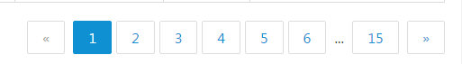

# VUE项目快速构建

vue的核心是数据驱动，它让数据与DOM保持同步，我们只需操作修改数据，而不用再每次都要进行DOM操作。需于[其官网](http://vuejs.org.cn/)了解其概念和使用语法后，开始构建1个简单的项目作为练习了。

## 1.快速构建项目

这里选择使用官方出品的脚手架工具 [vue-cli](https://github.com/vuejs/vue-cli)快速地构建项目,打开终端运行命令：

```
   npm install -g vue-cli
vue init webpack vueproject
```

备注：

- 如果于Mac进行全局安装时需命令前面加sudo，即运行`sudo npm install -g vue-cli`
- `vue init webpack vueproject`语句中vueproject为项目名称,webpack为构建所用的模板类型，除了webpack还有webpack-simple,browserify,browserify-simple,simple,另外还可以用本地的文件作为模板(模板的介绍及使用请参照[vue-cli](https://github.com/vuejs/vue-cli))。

按照提示进行下一步操作:

```
? Project name vueproject
? Project description A Vue.js project
? Author
? Use ESLint to lint your code? No
? Setup unit tests with Karma + Mocha? No
? Setup e2e tests with Nightwatch? No
```

(暂不使用检查测试工具输入n进行下一步)

```
cd vueproject
npm install
npm run dev
```

打开<http://localhost:8080/>,可以看到如下图页面： 

## 2.项目模板结构

打开vueproject文件夹可以看到如下图结构:<br>
<br>
其中：

- build－开发和生产环境的webpack构建文件，如果需要定制webpack才需修改里面的文件
- config－参数设置文件，里面暴露了一些build时的参数可选项,比如设置ajax请求代理等
- dist－构建后生成的文件目录
- src－代码编写目录
- static－静态资源，不需要经过webpack编译处理的文件放于此处（比如压缩的bootstrap文件）

src文件夹内又包含App.vue和main.js文件,assets和component文件夹。 app.vue根组件,main.js为入口文件 assets为存放静态资源的目录，与static不同，这里的文件会经webpack处理。<br>
在典型的 Vue.js 项目中，界面被拆分为多个小组件， 每个组件于同一个文件封装它的 CSS 样式，html模板和 JavaScript，项目模板里面已经有一个名为hello.vue的组件作为例子，依照其使用及构建，这里将以写一个简单通用的分页组件作为例子。<br>
一般使用分页组件时需要定义的是当前页数及总页数，在组件中将其定义成props并且声明为双向绑定，这样在点击分页组件的操作可以同时反映到使用该组件的文件中。后期使用时就无需再定义如上一页下一页或点击某页的操作了，只需在本组件中使用$watch观察数据变动，进行相应的操作。

- 组件内部<br>
  template

  ```html
  <template>
  <div class="paging">
  <ul class="am-pagination am-pagination-right am-hide-sm">
  <li :class="(pages.currentNo===1||pages.pageTotal===0)?'am-disabled':''" @click="golastPage"><a>«</a></li>
  <!-- page <＝10 -->
  <li v-if="pages.pageTotal<11" v-for="page in pages.pageTotal" :class="pages.currentNo===page+1?'am-active':''" @click="goPage(page+1)"><a>
    {{page+1}}</a></li>
  <!-- other cases -->
  <li v-if="pages.pageTotal>10&&pages.currentNo>4" :class="pages.currentNo===1?'am-active':''" @click="goPage(1)"><a>1</a></li>
  <li v-if="pages.pageTotal>10&&pages.currentNo>4" class="noneShow"><span>...</span></li>
  <li v-if="pages.pageTotal>10" @click="goPage(page)" v-for="page in pagesMiddle" :class="pages.currentNo===page?'am-active':''"><a>{{page}}</a></li>
  <li v-if="pages.pageTotal>10&&pages.currentNo<pages.pageTotal-3" class="noneShow"><span>...</span></li>
  <li v-if="pages.pageTotal>10&&pages.currentNo<pages.pageTotal-3"  :class="pages.currentNo===pages.pageTotal?'am-active':''" @click="goPage(pages.pageTotal)"><a>{{pages.pageTotal}}</a></li>
  <li :class="(pages.currentNo===pages.pageTotal||pages.pageTotal===0)?'am-disabled':''" @click="gonextPage">
    <a>»</a></li>
  </ul>
  <ul class="am-pagination am-show-sm-only">
  <li class="am-pagination-prev"><a>« 上一页</a></li>
  <li class="am-pagination-next"><a>下一页 »</a></li>
  </ul>
  </div>
  </template>
  ```

  script部分

```javascript
<script>
export default {
props: {
  pages: {
    type: Object,
    required: true,
    twoWay: true
},
computed:{
      pagesMiddle:function(){
            if(this.pages.pageTotal>10&&this.pages.currentNo>this.pages.pageTotal-4)
            return [this.pages.pageTotal-5,this.pages.pageTotal-4,this.pages.pageTotal-3,this.pages.pageTotal-2,this.pages.pageTotal-1,this.pages.pageTotal];
            else if(this.pages.pageTotal>10&&this.pages.currentNo<5)
            {return [1,2,3,4,5,6];}
            else{
                return [this.pages.currentNo-2,this.pages.currentNo-1,this.pages.currentNo,this.pages.currentNo+1,this.pages.currentNo+2];
            }
        }
},
methods:{
    goPage:function(page){
        this.pages.currentNo=page;
    },
    gonextPage:function(){
        if(this.pages.currentNo<this.pages.pageTotal){
            this.pages.currentNo=this.pages.currentNo+1;
        }
    },
    golastPage:function(){
       if( this.pages.currentNo>1){
            this.pages.currentNo=this.pages.currentNo-1;
        }
}
}


}
}
</script>
```

style部分(样式采用[AMAZEUI框架](http://amazeui.org)，再添加部分样式以简化代码内容)

```css
<style>
li.noneShow >span,li.noneShow >span:hover{
    border: none;
    background-color: #fff;
    color: #333;
    cursor: auto;
    padding: 0;
}

</style>
```

- 使用方式，添加`<paging :pages.sync="pageInfo"></paging>` 引入文件`import paging from './路径名称/paging.vue'`

```
watch:{
    'pageInfo.currentNo':function(val,oldVal){
        console.log(“当前页数为： ”+val);
        //do sth  
    }
},
components: {
  paging
}
```

> 定义数据结构 pageInfo:{ pageTotal:50, currentNo:5 } pageTotal：总页数；currentNo：当前页数 该组件显示的页数为10页以内全部页数显示，10页以上当前页数的前后两页数都显示，总页数为7不足时往前或者后填充，第一页和最后一页一直显示。该例可通过修改computed pagesMiddle 来进行优化控制。本例最后效果如下：  
